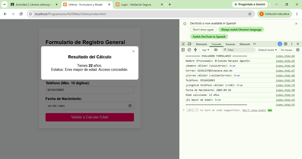
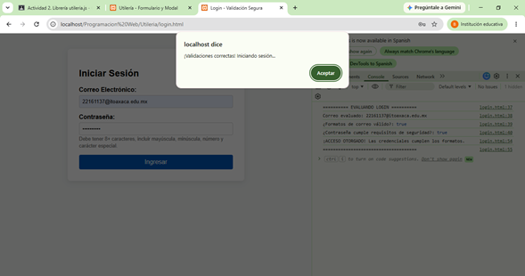

# Proyecto: Librería de Utilería JS

**Alumna:** Marquez Agustin Briseida  
**Curso:** 2026 Verano 7 a 10 - Programación Web

---

## Descripción del Proyecto

**Objetivo:** Crear una librería JS funcional (sin frameworks, sin componentes visuales) que se usará en un formulario, modal y login.html.

Este proyecto consiste en resolver validación de formularios, formateo seguro de datos y cálculos basados en fechas, garantizando la consistencia de la información antes de ser procesada o enviada a un servidor.

El proyecto incluye 6 funciones principales:

1. `validarCorreo(correo)` → boolean — valida formato de correo electrónico
2. `soloLetras(texto)` → boolean — solo letras mayúsculas/minúsculas, acepta vocales acentuadas
3. `validarLongitud(numero, maxLongitud)` → boolean — valida longitud de un número
4. `calcularEdad(fechaNacimiento)` → número entero — calcula edad a partir de fecha de nacimiento
5. `esMayorDeEdad(fechaNacimiento)` → boolean — valida si es mayor de edad
6. `validarPassword(password)` → boolean — requiere mayúscula, minúscula, número, carácter especial y mínimo 8 caracteres

También incluye 2 funciones adicionales:

- **`capitalizarTexto(texto)`**: corrige lo que el usuario escribe (incluso si lo escribió todo en minúsculas o todo en mayúsculas desordenadas), dejando cada palabra con su primera letra en mayúscula.
- **`limpiarEspacios(texto)`**: quita los espacios vacíos que quedan antes de la letra o al escribir doble espacio en medio del texto.

---

## Instalación

Para utilizar esta librería, agrega esta línea dentro de tu página HTML:

```html
<script src="js/utileria.js"></script>
```

---

## Código de la librería

```javascript
// 1. Validar formato de correo electrónico
function validarCorreo(correo) {
    const regex = /^[^\s@]+@[^\s@]+\.[^\s@]+$/;
    return regex.test(correo);
}

// 2. Solo letras (mayúsculas/minúsculas, acepta espacios y vocales acentuadas)
function soloLetras(texto) {
    const regex = /^[a-zA-ZáéíóúÁÉÍÓÚñÑ\s]+$/;
    return regex.test(texto);
}

// 3. Valida la longitud máxima de dígitos de un número
function validarLongitud(numero, maxLongitud) {
    return String(numero).length <= maxLongitud;
}

// 4. Calcula edad exacta a partir de una fecha de nacimiento (YYYY-MM-DD)
function calcularEdad(fechaNacimiento) {
    if (!fechaNacimiento) return 0;
    const hoy = new Date();
    const cumpleanos = new Date(fechaNacimiento);
    let edad = hoy.getFullYear() - cumpleanos.getFullYear();
    const mes = hoy.getMonth() - cumpleanos.getMonth();

    if (mes < 0 || (mes === 0 && hoy.getDate() < cumpleanos.getDate())) {
        edad--;
    }
    return edad;
}

// 5. Valida si es mayor de edad (18 años o más)
function esMayorDeEdad(fechaNacimiento) {
    return calcularEdad(fechaNacimiento) >= 18;
}

// 6. Requiere mayúscula, minúscula, número, carácter especial y mínimo 8 caracteres
function validarPassword(password) {
    const tieneMayuscula = /[A-Z]/.test(password);
    const tieneMinuscula = /[a-z]/.test(password);
    const tieneNumero = /[0-9]/.test(password);
    const tieneEspecial = /[\W_]/.test(password);
    const largoCorrecto = password.length >= 8;

    return tieneMayuscula && tieneMinuscula && tieneNumero && tieneEspecial && largoCorrecto;
}

// --- Las 2 funciones que agregué ---

// 1. Limpiar espacios extra al inicio, final y duplicados en medio
function limpiarEspacios(texto) {
    return texto.trim().replace(/\s+/g, ' ');
}

// 2. Capitalizar la primera letra de cada palabra (formato de nombre propio)
function capitalizarTexto(texto) {
    return texto.toLowerCase().replace(/\b\w/g, l => l.toUpperCase());
}
```

---

## Evidencias

### Capturas del formulario




### Video de demostración

<!-- 
Para insertar el video:
1. Ve a tu repositorio en GitHub (en la web) → pestaña "Issues" → "New Issue".
2. Arrastra el archivo Utilería.mp4 dentro del cuadro de texto.
3. Espera a que termine de subir; GitHub generará un link tipo:
   https://github.com/user-attachments/assets/xxxxxxxx-xxxx-xxxx-xxxx-xxxxxxxxxxxx
4. Copia ese link y pégalo abajo, reemplazando esta línea.
-->

https://github.com/user-attachments/assets/Video Utileria